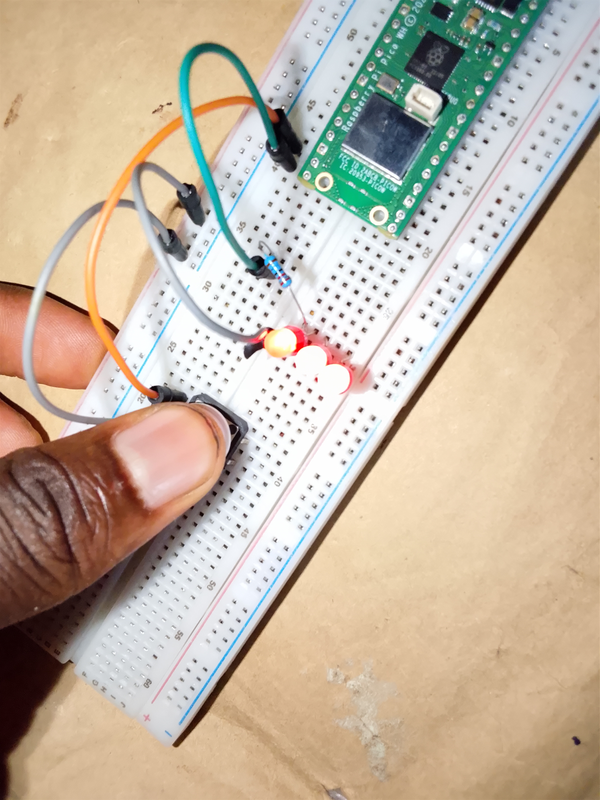

# Push-Button-LED-Controller

This project demonstrates how to control an LED using a push button on the Raspberry Pi Pico W. The LED turns ON when the button is pressed and turns OFF when the button is released.

## Components Used

* Raspberry Pi Pico W
* LED
* Push Button
* Breadboard
* Jumper Wires

## Project Code

[Click here to check out the code](code/Using_button_as_pull_up_in_micropython.py)

## Project Images

## Project Demo Video

[Click here to download the video](https://youtube.com/shorts/QpQH0YHqfrE?si=p03k086MFrf9RjYm)

## Programming Language

* MicroPython

## Features

* Push button input detection
* LED output control
* Real-time response
* Internal pull-up resistor configuration

## Pin Connections

* Push Button → GP14
* LED → GP15

## How It Works

The program continuously reads the state of the push button. When the button is pressed, the LED turns ON. When the button is released, the LED turns OFF.c
